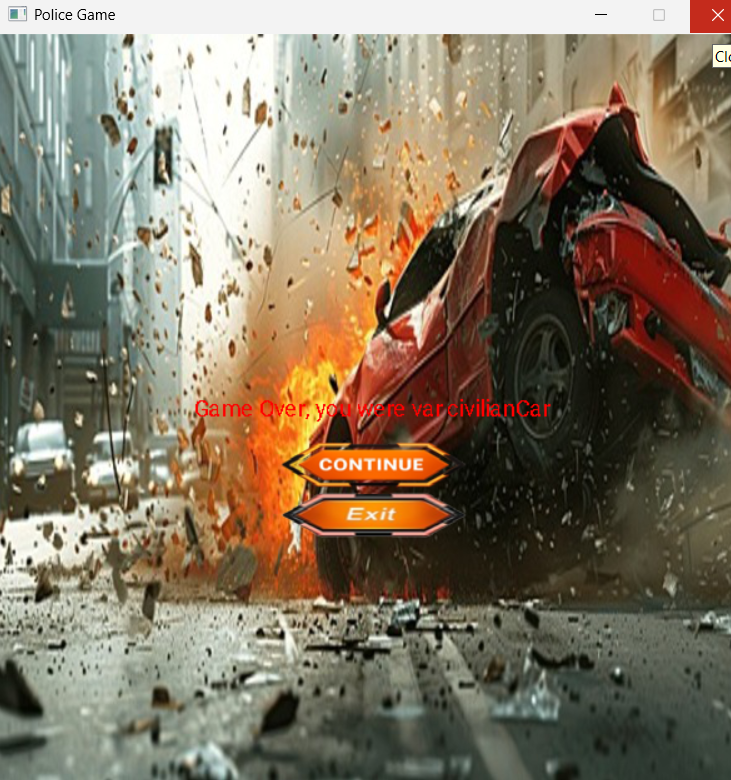
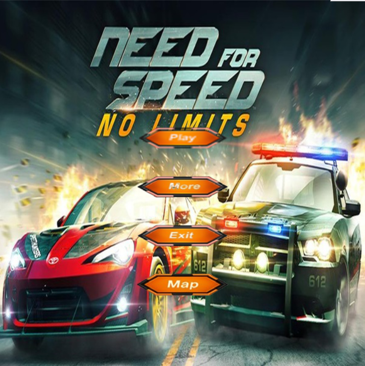
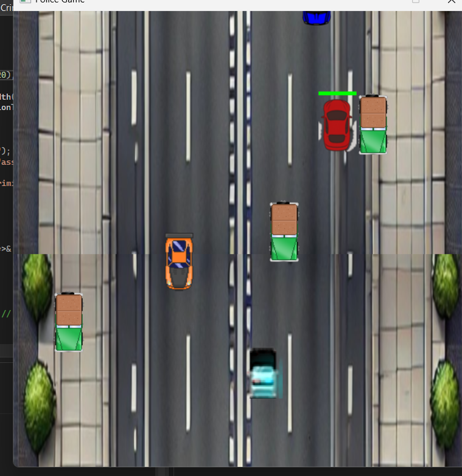

# 🚓 Police vs Criminals - Action Game 🔫  

**Bạn đã sẵn sàng tham gia cuộc rượt đuổi tốc độ cao với những tên tội phạm nguy hiểm nhất?**  
Một tựa game **hành động kịch tính**, nơi bạn lái **xe cảnh sát**, truy đuổi **xe tội phạm**, **bắn súng**, và **né xe dân** trên đường phố!.Lấy ý tưởng từ game đua xe né chướng ngại vật từ thời nokia 1280 cũ nhưng được cải biến thêm nhiều tính năng.Let's tryy nowww!

🎬 **Xem demo game**: [Giải thích code](https://www.youtube.com/watch?v=QwXQ3mW2XoU) | [Gameplay chính](https://youtube.com/shorts/pNnejwmNqWg)  

## 🚀 Cách tải game  
Có hai cách để bạn có thể chơi:  

### 1️⃣ **Không bao gồm code**  
- **Tải bản nén (.zip):** [Download tại đây](https://github.com/truonghoange/Projectgamepolicevszangho/releases/latest)  
- **Giải nén** vào thư mục và chạy `police_vs_criminals.exe` để chơi.  

### 2️⃣ **Bao gồm code và có thể biên dịch**  
- Clone repo hoặc tải `.zip`:  
  ```sh
  git clone https://github.com/truonghoange/Projectgamepolicevszangho
-sau khi cài ide và sdl2 thì mọi người có thể chơi game.

🎮 Hướng dẫn chơi
- Bắt đầu game: Click vào nút "CLICK TO START!" để khởi động.
- Truy đuổi tội phạm: Lái xe và tiêu diệt chúng bằng vũ khí của bạn!
- Các thành phần trong game:
- 🚗 Xe cảnh sát: Phương tiện chính của bạn, có thể bật siren.
- 🏹 Xe tội phạm: Kẻ địch có trí tuệ nhân tạo, biết cách né tránh xe dân!
- 💣 Hiệu ứng cháy nổ: Xe dân bị tông nổ tung, đạn bay, khói lửa!
- 📉 Thanh tiến trình game: Hiển thị vị trí của bạn trên đường đua.
- 🔫 Hệ thống vũ khí: Nhấn J để bắn súng vào xe tội phạm.
- ⏸️ Nút pause: Dừng game hoặc điều chỉnh âm lượng nhạc nền.

🏁 Các loại phương tiện
| 🚗 Loại xe | 🔥 Chức năng | 

| Cảnh sát | Xe có thể bắn súng, bật siren, nhưng không được đâm xe dân. | 

| Tội phạm | Xe có AI, biết tránh xe dân nhưng sẽ nổ tung nếu va chạm. | 

| Xe dân | Xe vô tội, nếu bị cảnh sát đâm vào thì game over! | 


🏆 Chiến thắng và thất bại

| Tình huống | Kết quả | 

| 🚔 Tiêu diệt xe tội phạm | ✅ Thắng | 

| 🚗 Đâm/Bắn phải xe dân | ❌ Thua | 

| 🚨 Xe cảnh sát tụt lại quá xa | ❌ Thua | 


📷 Hình ảnh trong game

🎮 Giao diện chính


🚗 Xe cảnh sát rượt đuổi


🛠️ Công nghệ sử dụng
🔹 Ngôn ngữ: C++
🔹 Thư viện: SDL2
🔹 Đồ họa: Photoshop, Tiled
🔹 Hình ảnh: AI-generated, OpenArt, Pinterest
🔹 Âm thanh: WAV

🚗 Mẹo chơi

✅ Tránh xe dân bằng cách lạng lách khéo léo!

✅ Kẻ địch có AI né tránh rất nhanh, hãy canh chuẩn xác khi bắn!

✅ Sử dụng siren để đánh lừa đối thủ và thay đổi chiến thuật!

🚀 Cách chạy game
🔹 Cách 1 - Chạy source code
1️⃣ Clone repo:
git clone https://github.com/truonghoange/Projectgamepolicevszangho.git


2️⃣ Cài đặt SDL2 & IDE phù hợp.
3️⃣ Chạy game và tham gia cuộc truy đuổi ngay!
🔹 Cách 2 - Chạy bản nén
1️⃣ Tải file .zip.
2️⃣ Giải nén.
3️⃣ Chạy game và trải nghiệm ngay!

🔹 Đóng góp & phát triển: Nếu bạn muốn tham gia cải thiện game, hãy mở một issue hoặc gửi pull request!
✨ Chúc bạn chơi game vui vẻ! 🚀



